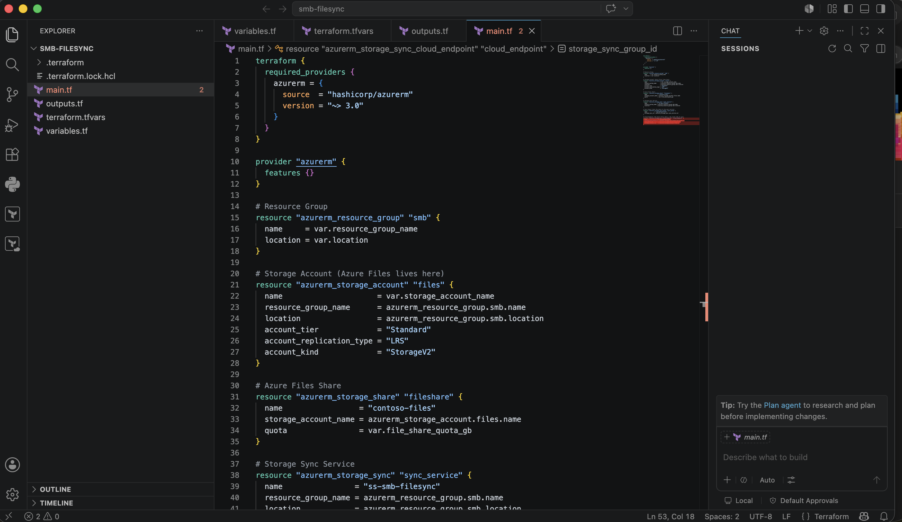
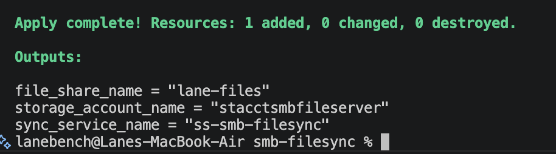
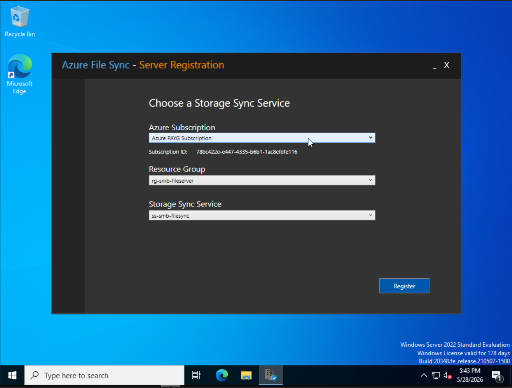
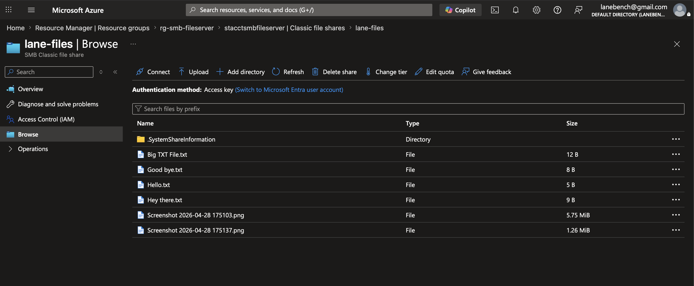

# Azure Hybrid File Sync

Connects an on-premises Windows Server 2022 file server to Azure Files using Azure File Sync. All cloud infrastructure is provisioned with Terraform. Files sync automatically between the local server and Azure, providing cloud backup and remote access without fully migrating off-premises.

---

## Architecture

```
On-Premises (Proxmox)                    Azure
┌──────────────────────┐            ┌─────────────────────────┐
│  Windows Server 2022 │            │  Storage Account        │
│  └── Sync Folder     │◄──sync────►│  └── Azure Files Share  │
│      └── Your files  │            │                         │
└──────────────────────┘            │  Storage Sync Service   │
                                    │  └── Sync Group         │
                                    │      └── Cloud Endpoint │
                                    └─────────────────────────┘
```

---

## Tech Stack

- **Terraform** — infrastructure as code for all Azure resources
- **Azure Files** — cloud file share (SMB protocol)
- **Azure File Sync** — bidirectional sync between on-prem and Azure
- **Windows Server 2022** — on-premises file server (Proxmox VM)
- **Azure RBAC** — least-privilege access for the Storage Sync service principal

---

## Resources Provisioned via Terraform

| Resource | Name |
|---|---|
| Resource Group | rg-smb-fileserver |
| Storage Account | stacctsmbfileserver |
| Azure Files Share | lane-files |
| Storage Sync Service | ss-smb-filesync |
| Sync Group | sg-lane-files |
| Cloud Endpoint | ce-lane-files |

---

## Prerequisites

- Terraform installed (`brew install hashicorp/tap/terraform`)
- Azure CLI installed and authenticated (`az login`)
- An Azure subscription
- A Windows Server 2022 machine (physical or VM) acting as the file server

---

## Deployment

**1. Clone the repo**
```bash
git clone https://github.com/lanebench/azure-hybrid-file-sync.git
cd azure-hybrid-file-sync
```

**2. Create your tfvars file**
```bash
cat > terraform.tfvars << 'EOF'
storage_account_name = "your-unique-name-here"
EOF
```

> Storage account names must be globally unique, lowercase, 3–24 characters, no hyphens.

**3. Register the StorageSync resource provider**
```bash
az provider register --namespace Microsoft.StorageSync

# Wait until registered
az provider show --namespace Microsoft.StorageSync --query "registrationState"
```

**4. Initialize and deploy**
```bash
terraform init
terraform plan
terraform apply
```

**5. Grant Storage Sync access to the Storage Account**
```bash
# Get the Storage Sync service principal ID
az ad sp list --display-name "Microsoft.StorageSync" --query "[0].id" -o tsv

# Assign Reader and Data Access role
az role assignment create \
  --role "Reader and Data Access" \
  --assignee "<principal-id>" \
  --scope "/subscriptions/<subscription-id>/resourceGroups/rg-smb-fileserver/providers/Microsoft.Storage/storageAccounts/<storage-account-name>"
```

**6. Install the Azure File Sync agent on Windows Server**

Download the agent from: https://aka.ms/afs/agent

Select Windows Server 2022, install, and register the server to the Storage Sync Service created by Terraform.

**7. Create a Server Endpoint**

In the Azure Portal:
- Navigate to **Azure File Sync → ss-smb-filesync → Sync Groups → sg-lane-files**
- Click **Add server endpoint**
- Select your registered server and set the local folder path
- Click **Create** and wait for status to show **Healthy**

---

## Troubleshooting

**Issue 1: Microsoft.StorageSync provider not registered**

On fresh Azure subscriptions, the StorageSync resource provider is not registered by default. Terraform will fail when creating the Storage Sync Service with a `MissingSubscriptionRegistration` error. Fix:

```bash
az provider register --namespace Microsoft.StorageSync
az provider show --namespace Microsoft.StorageSync --query "registrationState"
```

Wait until the output returns `"Registered"` before running `terraform apply` again.

---

**Issue 2: MgmtStorageAccountAuthorizationFailed when creating Cloud Endpoint**

The Storage Sync service principal requires `Reader and Data Access` on the Storage Account before it can create the Cloud Endpoint. This is not granted automatically. Fix:

```bash
az ad sp list --display-name "Microsoft.StorageSync" --query "[0].id" -o tsv

az role assignment create \
  --role "Reader and Data Access" \
  --assignee "<principal-id>" \
  --scope "<storage-account-resource-id>"
```

---

## Screenshots

### Terraform main code


### Terraform apply complete


### Azure File Sync agent registration on Windows Server 2022


### Files synced to Azure Files share


---

## Author

**Lane Bench** — [LinkedIn](https://www.linkedin.com/in/lanebench0498/) · [GitHub](https://github.com/lanebench) · [Portfolio](https://lanebench.github.io/lanebench/)
